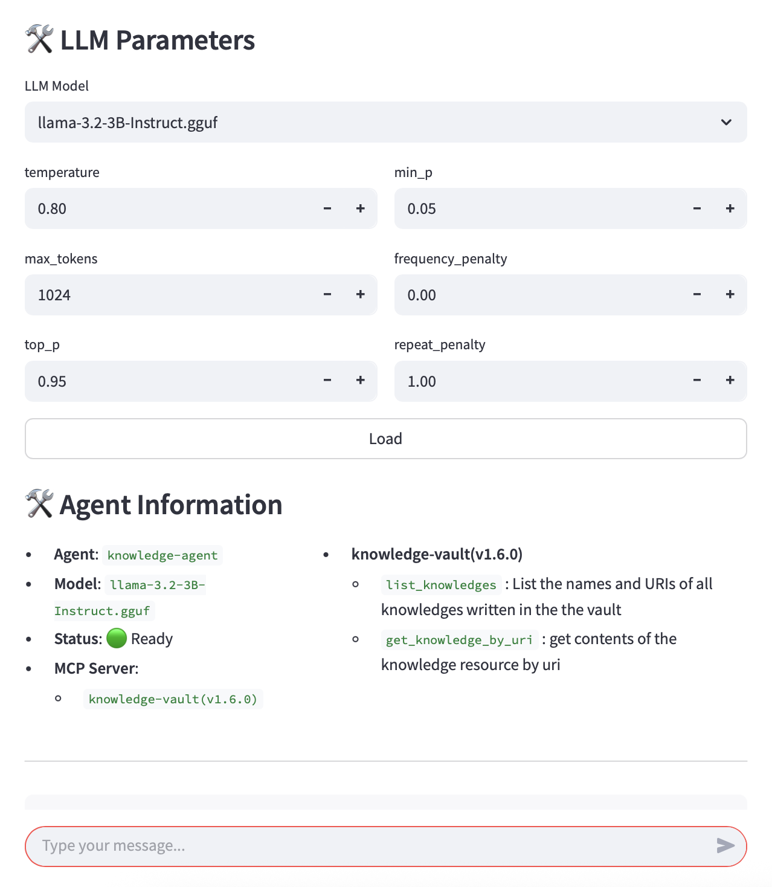
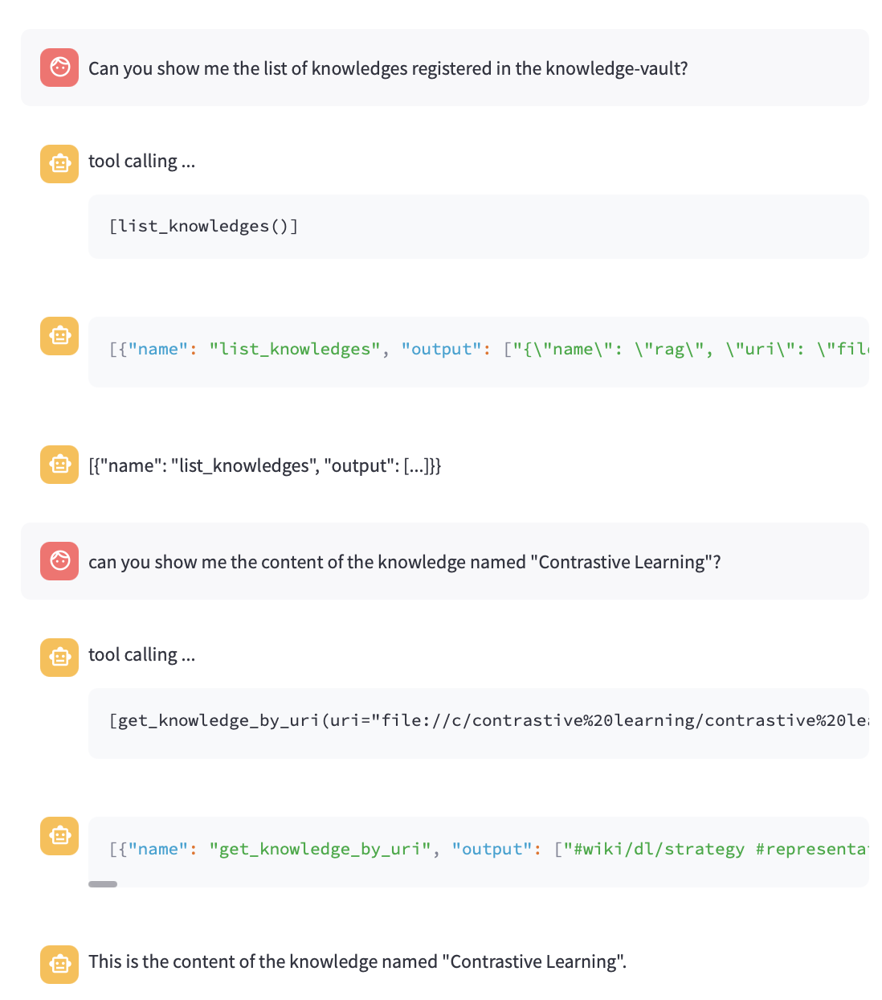

# MCP Knowledge Base

## Introduction

This repository is for building a private LLM agent that interfaces with an MCP client and server.

The MCP server is designed to connect only to my private Obsidian knowledge base, which is organized using Markdown files. For more details, please refer to this [Medium Article (How I built a local MCP server to connect Obsidian with AI)](https://medium.com/gitconnected/how-i-built-a-local-mcp-server-to-connect-obsidian-with-ai-55121295a985).

This repository includes the following components:
  * LLM Agent
  * MCP Client / Server

## Components

### MCP Server (knowledge-vault)

The MCP server, named knowledge-vault, manages Markdown files that serve as topic-specific knowledge notes. It provides the following tools:

* `list_knowledges()` : list the names and URIs of all knowledges written in the the vault
* `get_knowledge_by_uri(uri:str)` : get contents of the knowledge resource by uri

### Agent / MCP Client

This repository also contains a simple LLM agent implementation. It currently uses the Llama 3.2 model and leverages the MCP client to retrieve relevant knowledge context.

### Chat Interface

The agent can be used via a chat interface built with Streamlit. Please note that it is a prototype and may contain bugs.

Below is a screenshot showing LLM loading and parameter settings:

Below is a screenshot of the interactive chat view:

